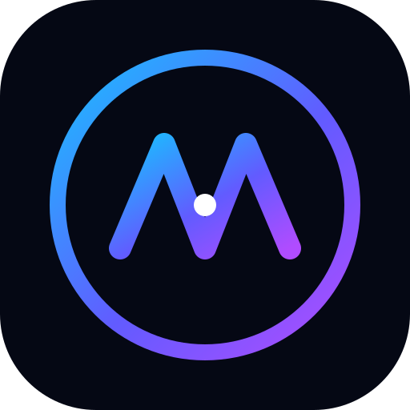
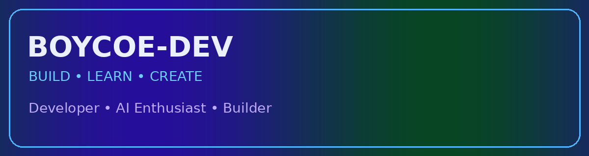

<div align="center">



# BOYCOE-DEV

### Full-Stack Developer • AI Enthusiast • Builder

<a href="https://nexora.zone.id"></a>
<a href="https://whatsapp.com/channel/0029VbBxPYN2kNFj3I1H1e0f"></a>

</div>



---

## 👋 About Me

I'm **Boycoe-Dev**, a developer who enjoys building modern websites, mobile apps, APIs and AI-powered projects.

I like turning ideas into real projects, experimenting with new technologies, and continuously improving my coding skills.

> **Build it. Break it. Learn it. Improve it.**

## 🚀 What I Build

- 🌐 Modern websites and web apps
- 📱 Android applications
- 🤖 AI-powered applications
- 🔌 APIs and backend systems
- 📚 Educational and offline-first apps
- 🧪 Experimental developer tools
- 🤖 WhatsApp & Telegram Bots

## 🛠️ Tech Stack

`HTML` `CSS` `JavaScript` `Python` `Node.js` `Java` `SQL` `Git` `GitHub` `Sketchware Pro`

## 🔥 Featured Projects

### 🐦 Delphine AI
An AI-focused project exploring modern AI features and APIs.

### 📚 Learn Hub
An offline learning app concept with books, PDFs, quizzes and coding courses.

### 📄 PDF Scraper API
A developer API concept for searching and working with PDF resources.

## 🔗 Connect With Me

| Platform | Link |
|---|---|
| 🌐 Website | [nexora.zone.id](https://nexora.zone.id) |
| 💬 WhatsApp Channel | [Join the channel](https://whatsapp.com/channel/0029VbBxPYN2kNFj3I1H1e0f) |
| 📱 WhatsApp | [+263 781 021 754](https://wa.me/263781021754) |

## ⚡ Currently

```text
> learning
> coding
> building
> experimenting with AI
> creating new projects
```

<div align="center">

### Thanks for visiting my profile! 🚀

⭐ Check out my repositories and follow the journey.

</div>
